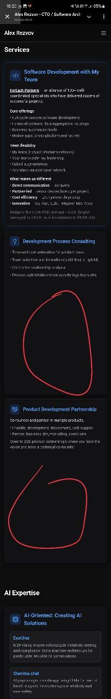
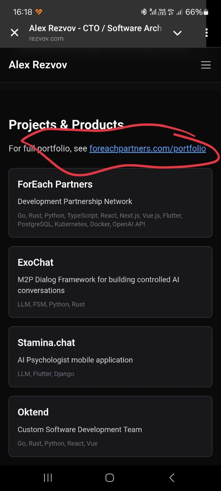
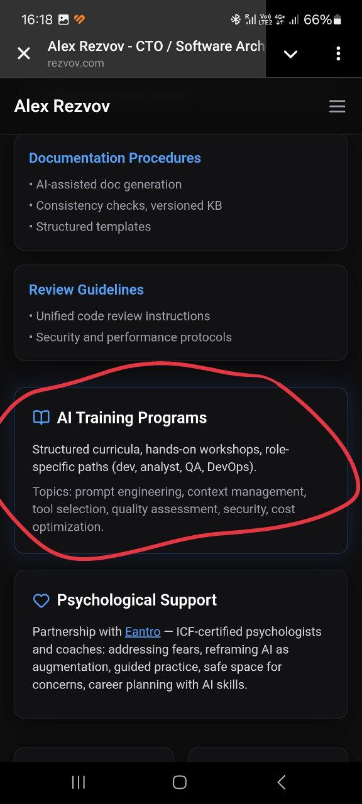
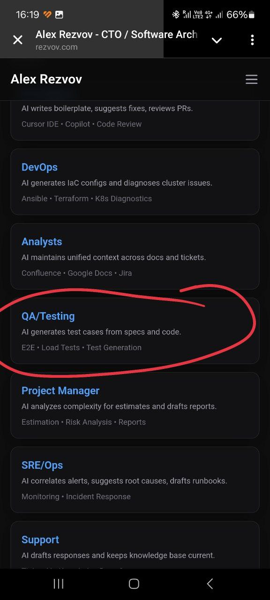
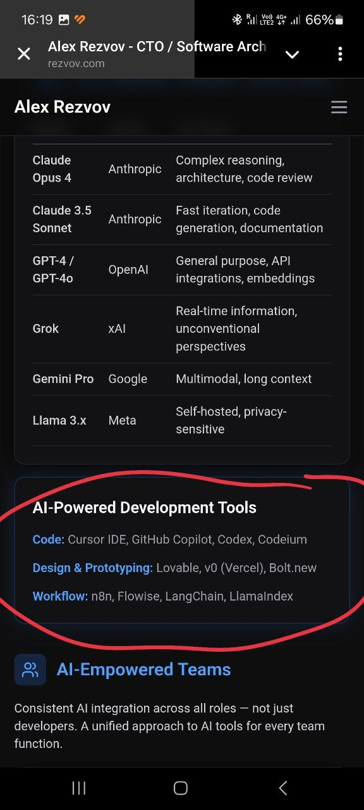
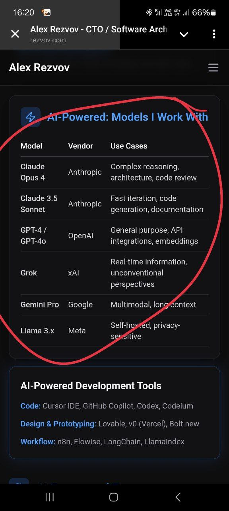
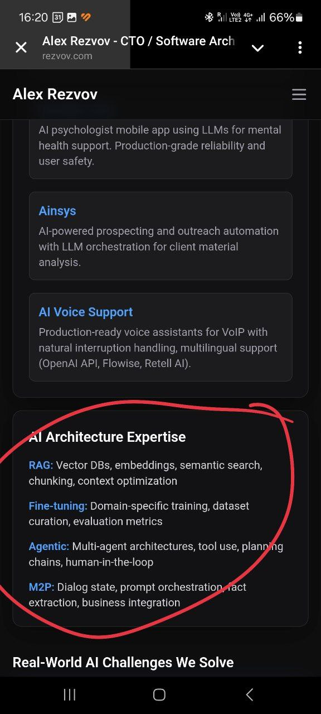

Анна Резвова, [1/28/26 4:21 PM]

Анна Резвова, [1/28/26 4:22 PM]
Я бы это выделила такой же плашкой, как все 4 ниже втом блоке, но другим цветом, чтобы бросалось в глаза, или цвет тот же но добавить рамку яркую. Иначе эта ссылка не читается вообще

Анна Резвова, [1/28/26 4:23 PM]
Не кажется, что текст модно усилить? Мне очень нравится, но может усилить именно...

Анна Резвова, [1/28/26 4:24 PM]
Тут ты как раз сегодня говорил о новой профессии QA. Я бы прям вот твои слова сюда бы воткнула для усиления. И там вроде M2M , а у тебя E2E... Может я чего не понимаю... Но тоже усилить как будто можно

Анна Резвова, [1/28/26 4:25 PM]
А где все эти новомодные клодкоды ?)))

Анна Резвова, [1/28/26 4:26 PM]
Этот блок всегда должен быть актуальным!!! Иначе это будет смотреться как что-то устаревшее

Анна Резвова, [1/28/26 4:27 PM]
Тоже может усилить тобой? 
И я не знаю на счёт M2P... И других аббревиатур. Если посмотреть именно с точки зрения тебя как СТО, на что бы ты клюнул?

Иллюстрации к сообщениям:

